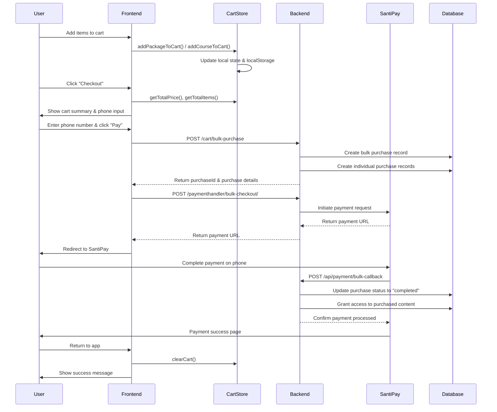

# 💳 Complete Payment Flow Guide

## 🎯 Overview

This guide provides a step-by-step walkthrough of how the cart and payment system works, including all API calls, data flow, and implementation examples.

## 📊 Payment Flow Diagram



## 🛒 Step 1: Adding Items to Cart

### Frontend Implementation

```typescript
// Adding a package to cart
import { useCartStore } from '@/app/store/cartStore';

const PackageCard = ({ packageData }) => {
  const { addPackageToCart, isInCart } = useCartStore();

  const handleAddToCart = () => {
    addPackageToCart({
      id: packageData.id,
      packageName: packageData.name,
      price: packageData.price,
      temporaryPrice: packageData.discountPrice,
      price2: packageData.price3Month,
      price3: packageData.price6Month,
      temporaryPrice2: packageData.discountPrice3Month,
      temporaryPrice3: packageData.discountPrice6Month,
      discountStatus: packageData.hasDiscount,
      discountExpiryDate: packageData.discountExpiry,
      imgUrl: packageData.image,
      tag: packageData.tag,
      courses: packageData.courses,
      selectedDuration: 1 // Default duration
    });
  };

  return (
    <div className="package-card">
      <h3>{packageData.name}</h3>
      <p>Price: {packageData.price} Birr</p>
      <button 
        onClick={handleAddToCart}
        disabled={isInCart(packageData.id, 'package')}
      >
        {isInCart(packageData.id, 'package') ? 'In Cart' : 'Add to Cart'}
      </button>
    </div>
  );
};
```

### Cart Store State Management

```typescript
// Cart store automatically handles:
// 1. Adding new items
// 2. Updating quantities for existing items
// 3. Persisting to localStorage
// 4. Calculating totals

const cartState = {
  items: [
    {
      type: 'package',
      id: 'pkg-123',
      packageName: 'Premium Package',
      price: 500,
      temporaryPrice: 400,
      selectedDuration: 3,
      quantity: 1
    },
    {
      type: 'course',
      id: 'course-456',
      courseName: 'Mathematics 101',
      price: 200,
      temporaryPrice: 150,
      quantity: 2
    }
  ],
  totalItems: 3,
  totalPrice: 700 // (400 * 1) + (150 * 2)
};
```

## 💳 Step 2: Checkout Process

### Cart Page Implementation

```typescript
// src/app/(commerce)/cart/page.tsx
import { processCartCheckout, validateCartItems, formatEthiopianPhoneNumber } from '@/lib/cartAPI';

const CartPage = () => {
  const { items, getTotalPrice, clearCart } = useCartStore();
  const [phoneNumber, setPhoneNumber] = useState('');
  const [isLoading, setIsLoading] = useState(false);

  const handleCheckout = async () => {
    // 1. Validate cart items
    const validation = validateCartItems(items);
    if (!validation.valid) {
      toast.error(validation.errors.join(', '));
      return;
    }

    // 2. Validate phone number
    if (!phoneNumber) {
      toast.error('Please enter your phone number');
      return;
    }

    // 3. Format phone number
    const formattedPhone = formatEthiopianPhoneNumber(phoneNumber);
    
    // 4. Get access token
    const accessToken = getAccessToken();
    if (!accessToken) {
      toast.error('Please log in to continue');
      return;
    }

    setIsLoading(true);

    try {
      // 5. Process cart checkout
      const result = await processCartCheckout(items, formattedPhone, accessToken);
      
      if (result.success) {
        if (result.paymentUrl) {
          // 6. Clear cart and redirect to payment
          clearCart();
          window.location.href = result.paymentUrl;
        } else {
          toast.success('Payment initiated. Check your phone for instructions.');
          clearCart();
        }
      } else {
        toast.error(result.message || 'Payment failed');
      }
    } catch (error) {
      toast.error('An error occurred during checkout');
    } finally {
      setIsLoading(false);
    }
  };

  return (
    <div className="cart-page">
      {/* Cart items display */}
      <div className="cart-items">
        {items.map(item => (
          <CartItem key={`${item.type}-${item.id}`} item={item} />
        ))}
      </div>

      {/* Checkout form */}
      <div className="checkout-form">
        <input
          type="tel"
          placeholder="09xxxxxxxx"
          value={phoneNumber}
          onChange={(e) => setPhoneNumber(e.target.value)}
        />
        <button 
          onClick={handleCheckout}
          disabled={isLoading || !phoneNumber}
        >
          {isLoading ? 'Processing...' : `Pay ${getTotalPrice()} Birr`}
        </button>
      </div>
    </div>
  );
};
```

## 🔌 Step 3: API Call Sequence

### API Call 1: Create Bulk Purchase

```typescript
// POST /cart/bulk-purchase
const createBulkPurchase = async (cartItems, phoneNumber, accessToken) => {
  // Separate packages and courses
  const packages = cartItems
    .filter(item => item.type === 'package')
    .map(item => {
      let price = item.discountStatus && item.temporaryPrice 
        ? item.temporaryPrice 
        : item.price;
      
      // Adjust price based on duration
      if (item.selectedDuration === 3) {
        price = item.discountStatus && item.temporaryPrice2 
          ? item.temporaryPrice2 
          : item.price2 || price;
      } else if (item.selectedDuration === 6) {
        price = item.discountStatus && item.temporaryPrice3 
          ? item.temporaryPrice3 
          : item.price3 || price;
      }

      return {
        packageId: item.id,
        duration: item.selectedDuration,
        quantity: item.quantity,
        price: price * item.quantity
      };
    });

  const courses = cartItems
    .filter(item => item.type === 'course')
    .map(item => {
      const price = item.discountStatus && item.temporaryPrice 
        ? item.temporaryPrice 
        : item.price;

      return {
        courseId: item.id,
        quantity: item.quantity,
        price: price * item.quantity
      };
    });

  // Calculate total amount
  const totalAmount = [...packages, ...courses].reduce(
    (sum, item) => sum + item.price, 
    0
  );

  const requestData = {
    packages,
    courses,
    totalAmount,
    phoneNumber,
    paymentMethod: "santipay"
  };

  const response = await fetch(`${apiUrl}/cart/bulk-purchase`, {
    method: "POST",
    headers: {
      "Content-Type": "application/json",
      Authorization: `Bearer ${accessToken}`,
    },
    body: JSON.stringify(requestData),
  });

  if (!response.ok) {
    const errorData = await response.json();
    throw new Error(errorData.message || "Failed to create bulk purchase");
  }

  return response.json();
};
```

**Request Example:**
```json
{
  "packages": [
    {
      "packageId": "pkg-premium-123",
      "duration": 3,
      "quantity": 1,
      "price": 400.00
    }
  ],
  "courses": [
    {
      "courseId": "course-math-456",
      "quantity": 2,
      "price": 300.00
    }
  ],
  "totalAmount": 700.00,
  "phoneNumber": "251912345678",
  "paymentMethod": "santipay"
}
```

**Response Example:**
```json
{
  "success": true,
  "purchaseId": "bulk-purchase-abc123",
  "message": "Bulk purchase created successfully",
  "packagePurchases": [
    {
      "id": "pp-123",
      "packageId": "pkg-premium-123",
      "studentId": "student-789",
      "duration": 3,
      "quantity": 1,
      "price": 400.00,
      "status": "pending",
      "createdAt": "2024-01-01T00:00:00Z"
    }
  ],
  "coursePurchases": [
    {
      "id": "cp-123",
      "courseId": "course-math-456",
      "studentId": "student-789",
      "quantity": 2,
      "price": 300.00,
      "status": "pending",
      "createdAt": "2024-01-01T00:00:00Z"
    }
  ]
}
```

### API Call 2: Initiate Bulk Payment

```typescript
// POST /paymenthandler/bulk-checkout/
const initiateBulkPayment = async (purchaseId, phoneNumber, totalAmount, cartItems, accessToken) => {
  const requestData = {
    purchaseId,
    phoneNumber,
    totalAmount,
    items: cartItems.map(item => ({
      type: item.type,
      id: item.id,
      packageName: item.type === 'package' ? item.packageName : undefined,
      courseName: item.type === 'course' ? item.courseName : undefined,
      price: item.type === 'package' 
        ? getPackagePrice(item) 
        : getCoursePrice(item),
      quantity: item.quantity,
      selectedDuration: item.type === 'package' ? item.selectedDuration : undefined
    }))
  };

  const response = await fetch(`${apiUrl}/paymenthandler/bulk-checkout/`, {
    method: "POST",
    headers: {
      "Content-Type": "application/json",
      Authorization: `Bearer ${accessToken}`,
    },
    body: JSON.stringify(requestData),
  });

  if (!response.ok) {
    const errorData = await response.json();
    throw new Error(errorData.message || "Failed to initiate bulk payment");
  }

  return response.json();
};
```

**Request Example:**
```json
{
  "purchaseId": "bulk-purchase-abc123",
  "phoneNumber": "251912345678",
  "totalAmount": 700.00,
  "items": [
    {
      "type": "package",
      "id": "pkg-premium-123",
      "packageName": "Premium Package",
      "price": 400.00,
      "quantity": 1,
      "selectedDuration": 3
    },
    {
      "type": "course",
      "id": "course-math-456",
      "courseName": "Mathematics 101",
      "price": 150.00,
      "quantity": 2
    }
  ]
}
```

**Response Example:**
```json
{
  "success": true,
  "paymentUrl": "https://santipay.com/pay/xyz789",
  "paymentReference": "santipay-ref-123",
  "message": "Payment initiated successfully",
  "expiresAt": "2024-01-01T01:00:00Z"
}
```

## 🔄 Step 4: Complete Payment Flow Implementation

```typescript
// Complete cart checkout function
export async function processCartCheckout(
  cartItems: CartItem[],
  phoneNumber: string,
  accessToken: string
): Promise<BulkPurchaseResponse> {
  try {
    // Step 1: Create bulk purchase
    const packages = cartItems
      .filter(item => item.type === 'package')
      .map(item => {
        const packageItem = item as CartPackageItem;
        let price = packageItem.discountStatus && packageItem.temporaryPrice 
          ? packageItem.temporaryPrice 
          : packageItem.price;
        
        if (packageItem.selectedDuration === 3) {
          price = packageItem.discountStatus && packageItem.temporaryPrice2 
            ? packageItem.temporaryPrice2 
            : packageItem.price2 || price;
        } else if (packageItem.selectedDuration === 6) {
          price = packageItem.discountStatus && packageItem.temporaryPrice3 
            ? packageItem.temporaryPrice3 
            : packageItem.price3 || price;
        }

        return {
          packageId: packageItem.id,
          duration: packageItem.selectedDuration,
          quantity: packageItem.quantity,
          price: price * packageItem.quantity
        };
      });

    const courses = cartItems
      .filter(item => item.type === 'course')
      .map(item => {
        const courseItem = item as CartCourseItem;
        const price = courseItem.discountStatus && courseItem.temporaryPrice 
          ? courseItem.temporaryPrice 
          : courseItem.price;

        return {
          courseId: courseItem.id,
          quantity: courseItem.quantity,
          price: price * courseItem.quantity
        };
      });

    const totalAmount = [...packages, ...courses].reduce(
      (sum, item) => sum + item.price, 
      0
    );

    const bulkPurchaseData = {
      packages,
      courses,
      totalAmount,
      phoneNumber,
      paymentMethod: "santipay"
    };

    // Create bulk purchase
    const purchaseResult = await createBulkPurchase(bulkPurchaseData, accessToken);

    if (purchaseResult.success && purchaseResult.purchaseId) {
      // Step 2: Initiate payment
      const paymentResult = await initiateBulkPayment({
        purchaseId: purchaseResult.purchaseId,
        phoneNumber,
        totalAmount,
        items: cartItems
      }, accessToken);

      return {
        ...purchaseResult,
        paymentUrl: paymentResult.paymentUrl
      };
    }

    return purchaseResult;
  } catch (error) {
    console.error("Error processing cart checkout:", error);
    throw error;
  }
}
```

## 📱 Step 5: Mobile App Implementation

### React Native Cart Checkout

```typescript
// Mobile cart checkout implementation
import { Linking } from 'react-native';
import { processCartCheckout } from '../services/cartAPI';

const MobileCheckoutScreen = () => {
  const [phoneNumber, setPhoneNumber] = useState('');
  const [isLoading, setIsLoading] = useState(false);
  const { items, clearCart } = useCartStore();

  const handleCheckout = async () => {
    try {
      setIsLoading(true);
      
      // Format phone number for Ethiopian format
      const formattedPhone = formatEthiopianPhoneNumber(phoneNumber);
      
      // Process cart checkout
      const result = await processCartCheckout(items, formattedPhone, accessToken);
      
      if (result.success && result.paymentUrl) {
        // Open payment URL in external browser
        const supported = await Linking.canOpenURL(result.paymentUrl);
        if (supported) {
          await Linking.openURL(result.paymentUrl);
          clearCart(); // Clear cart after successful payment initiation
        } else {
          Alert.alert('Error', 'Cannot open payment URL');
        }
      } else {
        Alert.alert('Error', result.message || 'Payment failed');
      }
    } catch (error) {
      Alert.alert('Error', 'An error occurred during checkout');
    } finally {
      setIsLoading(false);
    }
  };

  return (
    <View style={styles.container}>
      <TextInput
        placeholder="Phone Number (09xxxxxxxx)"
        value={phoneNumber}
        onChangeText={setPhoneNumber}
        keyboardType="phone-pad"
        style={styles.input}
      />
      
      <TouchableOpacity
        style={[styles.checkoutButton, isLoading && styles.disabled]}
        onPress={handleCheckout}
        disabled={isLoading || !phoneNumber}
      >
        <Text style={styles.checkoutButtonText}>
          {isLoading ? 'Processing...' : `Pay ${getTotalPrice()} Birr`}
        </Text>
      </TouchableOpacity>
    </View>
  );
};
```

## 🔄 Step 6: Payment Callback Handling

### Backend Callback Endpoint

```javascript
// POST /api/payment/bulk-callback
app.post('/api/payment/bulk-callback', async (req, res) => {
  try {
    const { referenceId, status, transactionId, amount, phoneNumber } = req.body;
    
    // Verify payment with SantiPay
    const paymentVerification = await verifySantiPayPayment(transactionId);
    
    if (paymentVerification.success && status === 'success') {
      // Start database transaction
      const transaction = await db.beginTransaction();
      
      try {
        // Update bulk purchase status
        await db.bulkPurchases.update({
          status: 'completed',
          transaction_id: transactionId,
          completed_at: new Date()
        }, {
          where: { id: referenceId },
          transaction
        });
        
        // Update all related purchase records
        await db.packagePurchases.update({
          status: 'completed',
          transaction_id: transactionId
        }, {
          where: { 
            id: { [Op.in]: await getBulkPurchasePackageIds(referenceId) }
          },
          transaction
        });
        
        await db.coursePurchases.update({
          status: 'completed', 
          transaction_id: transactionId
        }, {
          where: {
            id: { [Op.in]: await getBulkPurchaseCourseIds(referenceId) }
          },
          transaction
        });
        
        // Grant access to purchased content
        await grantAccessToPurchasedContent(referenceId, transaction);
        
        await transaction.commit();
        
        res.json({ success: true, message: 'Payment processed successfully' });
        
      } catch (error) {
        await transaction.rollback();
        throw error;
      }
      
    } else {
      // Handle failed payment
      await db.bulkPurchases.update({
        status: 'failed'
      }, {
        where: { id: referenceId }
      });
      
      res.json({ success: false, message: 'Payment failed' });
    }
    
  } catch (error) {
    console.error('Error handling bulk payment callback:', error);
    res.status(500).json({ success: false, message: 'Internal server error' });
  }
});
```

## 🧪 Step 7: Testing the Payment Flow

### Test Cart Checkout

```typescript
// Test function for cart checkout
const testCartCheckout = async () => {
  // 1. Add test items to cart
  const testPackage = {
    id: 'test-pkg-123',
    packageName: 'Test Package',
    price: 100,
    selectedDuration: 1,
    discountStatus: false
  };
  
  const testCourse = {
    id: 'test-course-456',
    courseName: 'Test Course',
    price: 50,
    discountStatus: false
  };
  
  // Add to cart
  addPackageToCart(testPackage);
  addCourseToCart(testCourse);
  
  // 2. Test checkout
  try {
    const result = await processCartCheckout(
      [testPackage, testCourse],
      '251912345678',
      'test-access-token'
    );
    
    console.log('Checkout result:', result);
    
    if (result.success && result.paymentUrl) {
      console.log('Payment URL:', result.paymentUrl);
      // In real app, redirect to payment URL
    }
  } catch (error) {
    console.error('Checkout error:', error);
  }
};
```

### API Testing with cURL

```bash
# Test bulk purchase creation
curl -X POST https://api.fayida.com/cart/bulk-purchase \
  -H "Content-Type: application/json" \
  -H "Authorization: Bearer YOUR_ACCESS_TOKEN" \
  -d '{
    "packages": [
      {
        "packageId": "pkg-123",
        "duration": 3,
        "quantity": 1,
        "price": 300.00
      }
    ],
    "courses": [
      {
        "courseId": "course-456",
        "quantity": 1,
        "price": 100.00
      }
    ],
    "totalAmount": 400.00,
    "phoneNumber": "251912345678",
    "paymentMethod": "santipay"
  }'

# Test bulk payment initiation
curl -X POST https://api.fayida.com/paymenthandler/bulk-checkout/ \
  -H "Content-Type: application/json" \
  -H "Authorization: Bearer YOUR_ACCESS_TOKEN" \
  -d '{
    "purchaseId": "bulk-purchase-abc123",
    "phoneNumber": "251912345678",
    "totalAmount": 400.00,
    "items": [
      {
        "type": "package",
        "id": "pkg-123",
        "packageName": "Test Package",
        "price": 300.00,
        "quantity": 1,
        "selectedDuration": 3
      }
    ]
  }'
```

## 📊 Step 8: Monitoring and Debugging

### Cart State Debugging

```typescript
// Debug cart state
const debugCartState = () => {
  const { items, getTotalItems, getTotalPrice } = useCartStore();
  
  console.log('Cart Debug Info:');
  console.log('Items:', items);
  console.log('Total Items:', getTotalItems());
  console.log('Total Price:', getTotalPrice());
  
  items.forEach((item, index) => {
    console.log(`Item ${index + 1}:`, {
      type: item.type,
      id: item.id,
      name: item.type === 'package' ? item.packageName : item.courseName,
      quantity: item.quantity,
      price: item.type === 'package' 
        ? getPackagePrice(item) 
        : getCoursePrice(item),
      total: (item.type === 'package' 
        ? getPackagePrice(item) 
        : getCoursePrice(item)) * item.quantity
    });
  });
};
```

### API Response Logging

```typescript
// Enhanced API call with logging
const createBulkPurchaseWithLogging = async (data, accessToken) => {
  console.log('Creating bulk purchase with data:', data);
  
  const response = await fetch(`${apiUrl}/cart/bulk-purchase`, {
    method: "POST",
    headers: {
      "Content-Type": "application/json",
      Authorization: `Bearer ${accessToken}`,
    },
    body: JSON.stringify(data),
  });

  console.log('Bulk purchase response status:', response.status);
  
  const result = await response.json();
  console.log('Bulk purchase response data:', result);
  
  if (!response.ok) {
    throw new Error(result.message || "Failed to create bulk purchase");
  }

  return result;
};
```

## 🚀 Step 9: Production Deployment

### Environment Configuration

```bash
# Production environment variables
API_URL=https://api.fayida.com
SANTIPAY_API_KEY=your-production-santipay-key
SANTIPAY_SECRET=your-production-santipay-secret
WEBHOOK_SECRET=your-webhook-secret
```

### Error Handling in Production

```typescript
// Production-ready error handling
const handleCheckoutError = (error: Error, context: any) => {
  // Log error for monitoring
  console.error('Checkout error:', {
    error: error.message,
    stack: error.stack,
    context,
    timestamp: new Date().toISOString()
  });
  
  // Send to error tracking service (e.g., Sentry)
  if (typeof window !== 'undefined' && window.Sentry) {
    window.Sentry.captureException(error, {
      tags: {
        component: 'cart-checkout',
        action: 'payment-initiation'
      },
      extra: context
    });
  }
  
  // Show user-friendly error message
  toast.error('Payment failed. Please try again or contact support.');
};
```

This complete payment flow guide provides everything you need to implement the cart and payment system. The flow is designed to be robust, scalable, and user-friendly while maintaining consistency between web and mobile applications.

